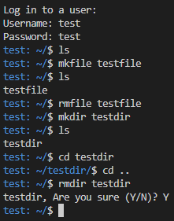

# Terminal
Terminal allows you to log into seperate accounts and access seperate files and use around seven different console commands.

This is a sample of what interacting with the terminal could look like:



### Change `dir.txt` Contents
Remember to change the `dir.txt` file to contain the path on your device that the python script (`terminal.py`) is located in (not including the `terminal.py` part).  
Ex:  
```python
fileLocation = 'C:/Users/<user>/Documents/Github/Code/terminal'
```  
if your `terminal.py` file is located in `'C:/Users/<user>/Documents/Github/Code/terminal'`.  
  
You can get the directory easily by downloading the `Code` repository, going into the `terminal` folder, clicking on the title bar and copying the path at the top. Then paste it onto the line:
```python
fileLocation = 
``` 
and then add single or double quotes around it and replace the backslashes (`\`) with forward slashes (`/`)  
  
### The program **_WILL NOT_** work properly without the `fileLocation` variable being set properly.
